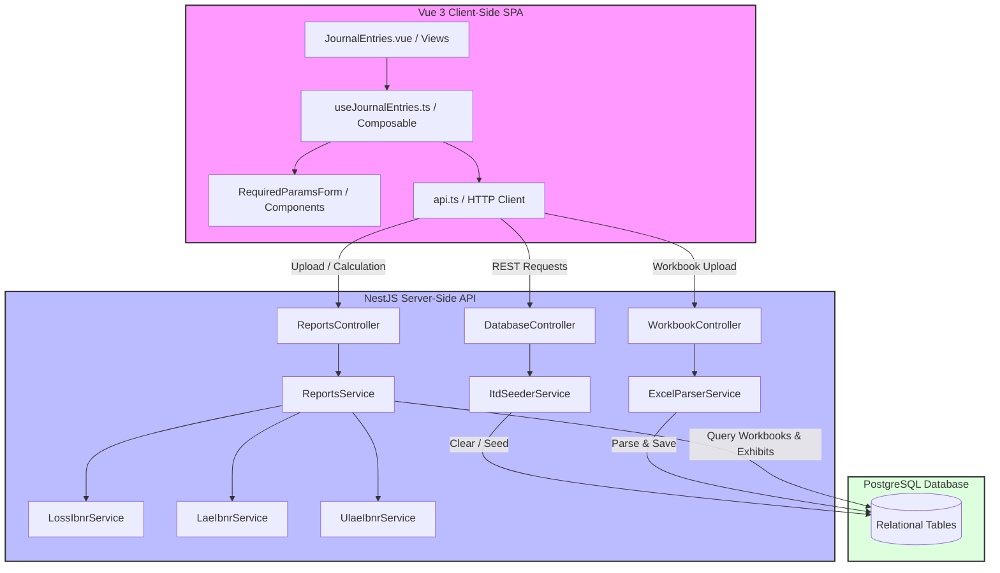
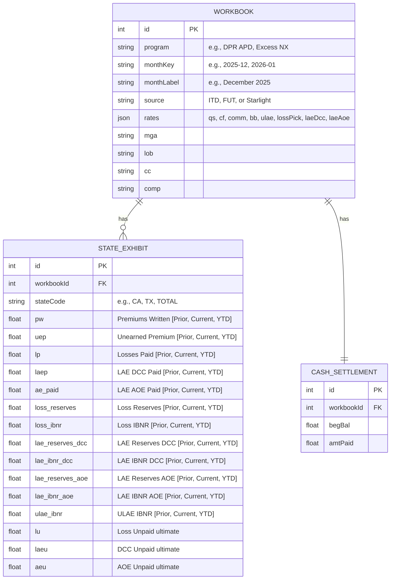
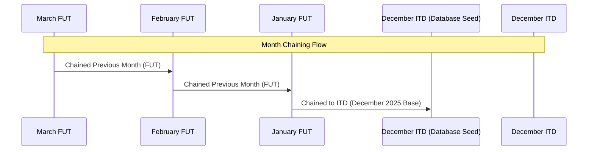

# Starlight Reinsurance System: Technical Architecture & Documentation

Welcome to the technical architecture documentation for the **Starlight Reinsurance System**. This system is built to automate the calculation of premium exhibits, actuarial statements, General Ledger (GL) journal entry mappings, and Cash Settlements across various reinsurance programs (e.g., APD, SAM, HS, MTC).

---

## 1. System Architecture Overview

The system follows a modern decoupled **Client-Server Architecture** using a TypeScript-based stack.

---

## 2. Technology Stack

### Frontend (Client SPA)
* **Framework**: Vue 3 (Composition API, Script Setup, TypeScript).
* **Build Tool**: Vite.
* **Styling**: Vanilla CSS with custom theme variables (supports dark/light mode transition).
* **HTTP Client**: Fetch API with clean service bindings (`api.ts`).

### Backend (Server API)
* **Framework**: NestJS (Enterprise Node.js framework, TypeScript).
* **ORM**: TypeORM (Object Relational Mapping).
* **Database**: PostgreSQL (port `5432`).
* **Excel Parsing**: `xlsx` (SheetJS) library.

---

## 3. Database Schema Design

The PostgreSQL database contains the following key entities:

*Note: In the database, historical values are stored as 3-length arrays representing `[Prior, Current, YTD]` to facilitate historical calculations.*

---

## 4. Key Calculation & Business Logic

### A. Month Chaining Sequence
To calculate the changes in reserves for a given reporting month (e.g., January 2026), the system links back to the previous month's ending values (e.g., December 2025 ITD).

- When the selected month ends in `-01` (January), the system searches for the **ITD workbook** (`source = 'ITD'`) of the same program to fetch baseline historical values.
- For subsequent months (e.g., February), the system looks for the previous consecutive month key (e.g., January FUT) under the same program and source.

### B. Reserve Change & IBNR Formulas
For an active **FUT** (Futuristic) workbook, ending case reserves are extracted from the Excel sheet row headers `lu`, `laeu`, and `aeu`. Ultimate and IBNR calculations are computed as follows:

1. **Premiums Earned**:
   $$\text{Premiums Earned} = \text{Premiums Written} + \text{Change in UEP (Previous UEP} - \text{Current UEP)}$$

2. **Ultimate Loss & LAE**:
   $$\text{Ultimate Loss} = \text{Premiums Earned} \times \text{Loss Pick \%}$$
   $$\text{Ultimate DCC} = \text{Premiums Earned} \times \text{LAE DCC \%}$$
   $$\text{Ultimate AOE} = \text{Premiums Earned} \times \text{LAE AOE \%}$$

3. **Change in Reserves**:
   $$\text{Change in Loss Reserves} = \text{Current Loss Reserves (FUT lu)} - \text{Previous Loss Reserves}$$
   $$\text{Change in Loss IBNR} = \text{Ultimate Loss} - \text{Losses Paid} - \text{Change in Loss Reserves}$$
   $$\text{Change in DCC Reserves} = \text{Current DCC Reserves (FUT laeu)} - \text{Previous DCC Reserves}$$
   $$\text{Change in DCC IBNR} = \text{Ultimate DCC} - \text{DCC Paid} - \text{Change in DCC Reserves}$$

4. **ULAE IBNR Reserves**:
   $$\text{Change in ULAE IBNR} = (0.5 \times \text{Change in Loss Reserves} + \text{Change in Loss IBNR}) \times 0.005$$

5. **Net Settlements**:
   - **Net Settlement due to/(from) Reinsurer**:
     $$\text{Net Settlement} = \text{PW} - \text{Ceding Commissions} - \text{Losses Paid} - \text{DCC Paid} - \text{AOE Paid} - \text{ULAE Paid} - \text{Boards Charge} - \text{Loss Ratio Cap Charge}$$
   - **Net Settlement due from NTA**:
     $$\text{Net Settlement NTA} = \text{PW} - \text{Ceding Commissions} - \text{Losses Paid} - \text{DCC Paid} - \text{AOE Paid} - \text{ULAE Paid}$$

---

## 5. Directory & Module Details

### Backend Codebase
* `src/database/database.controller.ts`: Controls database clearing and ITD seeding HTTP requests.
* `src/database/seeds/itd-seeder.service.ts`: Loads baseline ITD data from state JSON files, recalculates total state sums, and saves them to the DB.
* `src/database/seeds/states/`: Contains 38 individual state JSON seeders and `TOTAL.json` (aggregate) for December 2025.
* `src/modules/workbook/services/excel-parser.service.ts`: Handles spreadsheet uploading and parsing. Maps Excel rows dynamically depending on whether the workbook is Starlight or FUT.
* `src/modules/reports/services/reports.service.ts`: Core engine that calculates the reinsurance statement and cash settlements. Performs month chaining and applies actuarial reserve formulas.

### Frontend Codebase
* `src/views/JournalEntries.vue`: View containing reporting scope selectors (Program, Month, State), input forms, and calculation output tables.
* `src/composables/useJournalEntries.ts`: Manages state and integrates backend API queries. Implements the source-aware fallback logic and previous DCC-to-AOE parameter mapping.
* `src/components/RequiredParamsForm.vue`: Displays the 6 main required parameter fields for direct manual override/saving.

---

## 6. Design Patterns & Robustness Additions

### DCC to AOE Parameter Fallback
In programs where DCC is 0% and AOE is utilized (e.g. `DPR APD`), DCC IBNR is functionally 0, while AOE contains the reserves.
- **Frontend Fallback**: The UI contains a single field labeled `Previous LAE IBNR Reserves - DCC`. If `lae_ibnr_dcc` is `0`, the frontend dynamically maps this field to `lae_ibnr_aoe` (AOE).
- **Safe Save**: When saving changes from this field, if the DCC rate is `0` or DCC IBNR is `0`, the frontend routes the save payload directly to `lae_ibnr_aoe`, ensuring the database columns are not contaminated with wrong values.

### Global Seeder Verification
All December 2025 ITD baseline JSON seeds are aligned exactly with row values under Col C (Totals) of the main `Futuristic Starlight APD T2 2026 DRP.xlsx` workbook, ensuring that when January FUT workbooks are uploaded and chained to ITD, all state calculations match the Excel source sheets with zero discrepancy.
